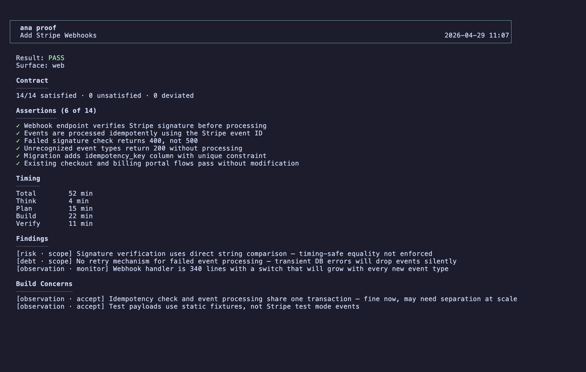

# Anatomia

[](https://github.com/anatomia-dev/anatomia/actions)
[](https://www.npmjs.com/package/anatomia-cli)
[](https://opensource.org/licenses/MIT)

Anatomia is a CLI and agent harness for Claude Code and Codex. It scans your codebase — detecting your stack, conventions, and patterns — then runs every change through a five-agent pipeline that saves every artifact: scope, spec, contract, build report, and independent verification. Other harnesses are prompt libraries. This one has an engine.

## Scan any project in 10 seconds


```bash
npx anatomia-cli scan .
```

No install. One command. [See more examples →](https://anatomia.dev/docs)

## Install

Install globally to use the `ana` command directly:

```bash
npm install -g anatomia-cli
```

Requires Node.js 22+. To update: `npm update -g anatomia-cli`

## Quick start

```bash
ana init                      # generate context + agents
ana init commit               # persist to git (so teammates get it too)
ana doctor                    # verify installation is healthy
ana run setup                 # enrich with your team's knowledge (optional, recommended, ~10 min)
ana run                       # start working — "hey Ana"
```

Tell Ana what you want to build. It'll investigate the codebase, surface tradeoffs, and push back if the approach has problems. When the scope is right, it hands off to Plan, Build, and Verify.

> `init` runs scan automatically and works standalone. The pipeline and setup run through Claude Code or Codex, and scan output works with any markdown-aware AI tool.
>
> `init commit` commits to the artifact branch — `staging`, `develop`, or your pre-production branch if one exists, otherwise `main`. Check with `ana config get artifactBranch` before your first commit.
>
> After updating the CLI, run `ana init` again to refresh scan data and skill detection. Your rules, context, and proof chain are preserved.

## What it does

### Scan + init

`ana scan` reads your project and detects framework, database, auth, testing, services, conventions, and patterns. In monorepos, scan identifies each surface (package or app) and detects per-surface commands. Re-running `ana init` refreshes scan data without overwriting your edits.

`ana init` writes that intelligence to files agents read:

- `ana.json` — project config: build/test/lint commands, surfaces, artifact branch, branch prefix. Every agent and CLI command reads this.
- `scan.json` — full structured scan data for agent consumption
- `CLAUDE.md` and `AGENTS.md` — cross-tool project context
- 5 core + 3 conditional skill templates with scan-driven Detected sections
- 16 stack-specific gotchas with compound triggers

Setup (`ana run setup`) bridges the gap between what scan detects and what your team knows. A ~10 minute session that investigates your codebase, asks 2-3 questions, and writes enriched context. After setup, agents understand your product and decisions — not just your stack.

### The pipeline

| Stage | Command&nbsp;&nbsp;&nbsp;&nbsp;&nbsp;&nbsp;&nbsp;&nbsp;&nbsp;&nbsp;&nbsp;&nbsp;&nbsp;&nbsp;&nbsp; | Role | Produces |
|-------|------|------|----------|
| Think | `ana run` | Thinking partner — scope, investigate, advise, push back | `scope.md` |
| Plan | `ana run plan` | Architect — design + sealed contract | `spec.md` + `contract.yaml` + `plan.md` |
| Build | `ana run build` | Builder — implement spec, prove it works | Code + tests + `build_report.md` |
| Verify | `ana run verify` | Fault-finder — reads spec and code, skips Build's report | `verify_report.md` |
| Learn | `ana run learn` | Proof analyst — runs between cycles | Stronger skills and system improvements |

### Proof intelligence

Every pipeline run writes a proof chain entry — here's one:



Each entry adds to a proof chain. `ana proof health` tracks the trajectory across runs — first-pass verification rate, risks per run, hot spots where findings cluster, and what to fix next. When patterns recur, `proof promote` turns them into skill rules that reach the next build. `proof audit` groups active findings by file. `proof stale` flags findings whose files changed since discovery.

## Commands

These are the commands you'll run directly:

```bash
ana scan [path]              # detect stack, conventions, patterns
ana init                     # generate context + agent definitions
ana init commit              # persist infrastructure to git
ana doctor                   # check project health
ana work status              # show pipeline state for active work
ana proof health             # quality trajectory dashboard
ana proof audit              # active findings grouped by file
ana proof <slug>             # display a proof chain entry
```

Pipeline agents invoke ~20 additional CLI commands — [the toolbelt](https://anatomia.dev/docs/concepts/toolbelt). When an agent saves an artifact, the CLI validates its structure, computes a content hash, and rejects malformed output. The agent can't skip a check. [Full CLI reference →](https://anatomia.dev/docs/reference/cli)

## Works with

Native pipeline support for [Claude Code](https://claude.com/code) and Codex.

Scan output (`AGENTS.md`, `CLAUDE.md`) works with any AI tool that reads markdown.

## Development

```bash
git clone https://github.com/anatomia-dev/anatomia.git
cd anatomia && pnpm install && pnpm build
cd packages/cli && pnpm vitest run
```

See [CONTRIBUTING.md](https://github.com/anatomia-dev/anatomia/blob/main/packages/cli/CONTRIBUTING.md) for extension guides and [ARCHITECTURE.md](https://github.com/anatomia-dev/anatomia/blob/main/packages/cli/ARCHITECTURE.md) for the module map.

This project is built with Anatomia. The `.ana/` directory is the proof — every feature was scoped, planned, built, and verified through the same pipeline this tool installs for you.

## Uninstalling

```bash
rm -rf .ana                        # all Anatomia data
rm .claude/agents/ana*.md          # Claude Code pipeline agents, if installed
rm -rf .codex/agents               # Codex agent manifests, if installed
rm AGENTS.md                       # generated project summary
```

Skill directories created by init live under `.ana/skills/`: `coding-standards`, `testing-standards`, `git-workflow`, `deployment`, `troubleshooting`, and conditionally `ai-patterns`, `api-patterns`, `data-access`. Remove the ones init created; keep any you added yourself.

If Anatomia created your `CLAUDE.md`, remove that too (`git blame CLAUDE.md` to check). If you ran `ana init commit`, revert: `git revert <commit-hash>`. Your source code is never modified.

```bash
npm uninstall -g anatomia-cli      # remove the CLI
```

## License

MIT
